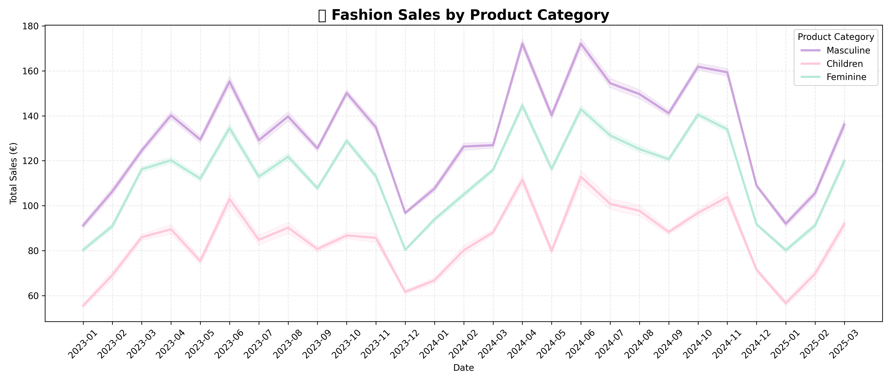
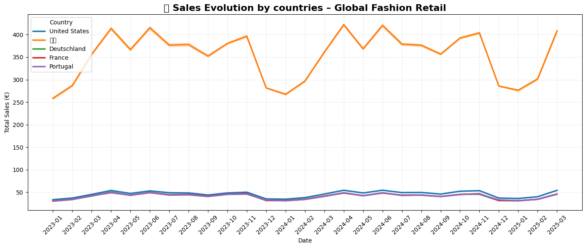
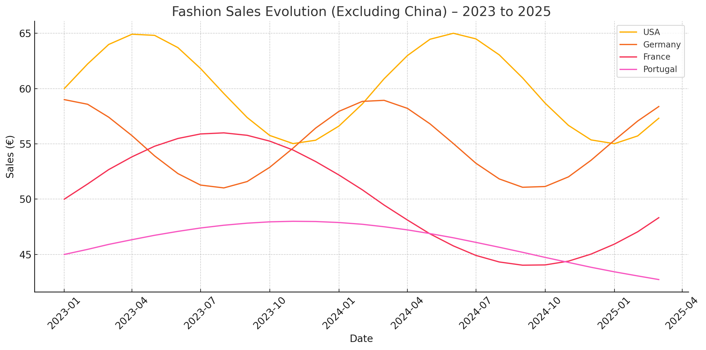

<p align="center">
  
</p>

<h1 align="center">🌍 Fashion Sales Analysis (2023–2025)</h1>

<p align="center">
  
  
  
</p>

---

## ✨ Overview

A data-driven exploration of global fashion retail sales from January 2023 to March 2025.

This project includes visualizations and insights on:
- Sales by **product category** (Masculine, Feminine, Children)
- Sales by **country** (China, USA, Germany, France, Portugal)
- Clean comparative charts excluding China for better cross-country analysis

---

## 📊 Visuals

### 🔹 Sales by Product Category


Masculine fashion leads globally, followed by feminine.  
Children’s fashion shows strong seasonal variation and holiday-driven spikes.

---

### 🔹 Sales by Country


China dominates retail sales.  
A separate chart was created without China for better country-to-country comparison.

---

### 🔹 Country Comparison (Excluding China)


US, Germany, France, and Portugal reveal more comparable sales patterns without being overshadowed.

---

## 🧠 Insights

- China’s market overshadows other countries in raw sales.
- Feminine fashion continues steady growth globally.
- Seasonal peaks align with known fashion calendar events.
- Comparative country-level analysis is clearer without China included.

---

## 🛠 Tools & Technologies

- Python
- Pandas
- Matplotlib
- Seaborn
- Jupyter Notebook

---

## 📁 Project Structure

```bash
fashion-sales-analysis/
│
├── data/
│   └── global_fashion_sales.csv
│
├── notebooks/
│   └── sales_analysis.ipynb
│
├── visuals/
│   ├── banner.png
│   ├── sales_by_category.png
│   ├── sales_by_country.png
│   └── sales_excluding_china.png
│
├── README.md
└── LICENSE
```

---

## 👩🏽‍💻 About Me

I'm a fashion & tech enthusiast, blending trend forecasting with data analysis.  
This project is part of my data portfolio focused on global fashion industry insights.

📌 [Behance](https://behance.net) | [LinkedIn](https://linkedin.com) | [Instagram](https://instagram.com)

---

## 📜 License

MIT License — free to use, modify, and share.
